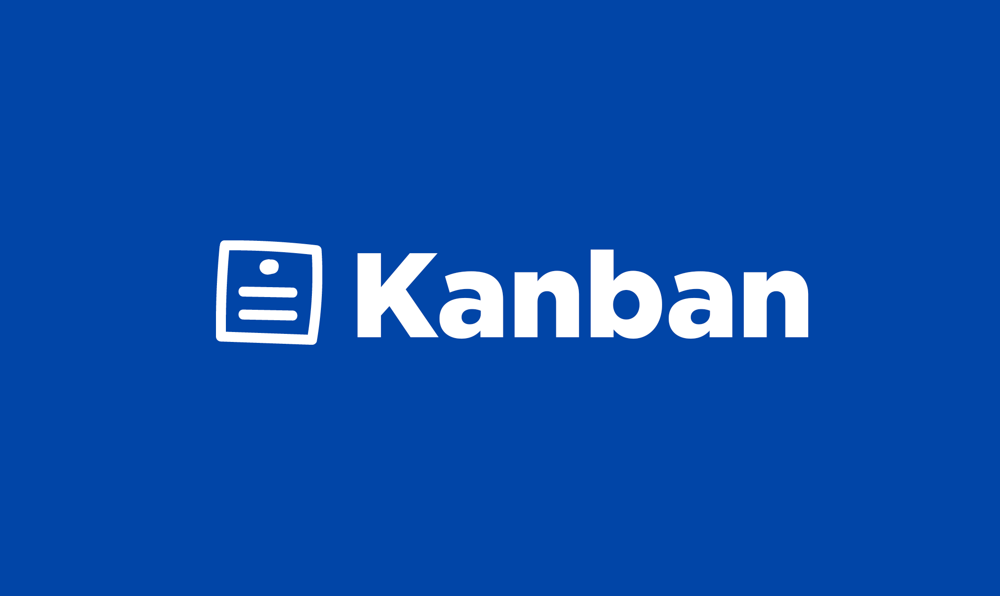

<a name="readme-top"></a>

<!-- PROJECT SHIELDS -->
<!--
*** I'm using markdown "reference style" links for readability.
*** Reference links are enclosed in brackets [ ] instead of parentheses ( ).
*** See the bottom of this document for the declaration of the reference variables
*** for contributors-url, forks-url, etc. This is an optional, concise syntax you may use.
*** https://www.markdownguide.org/basic-syntax/#reference-style-links
-->
[![Forks][forks-shield]][forks-url]
[![Stargazers][stars-shield]][stars-url]
[![Issues][issues-shield]][issues-url]
[![MIT License][license-shield]][license-url]


<!-- PROJECT LOGO -->
<br />
<div align="center">
  <a href="https://github.com/mwmerz/kanban-project">
    
  </a>

<h3 align="center">Screener Kanban Project</h3>

  <p align="center">
    basic kanban
    <br />
    <a href="https://github.com/mwmerz/kanban-project"><strong>Explore the docs »</strong></a>
    <br />
    <br />
    <a href="https://kanban-project-eight.vercel.app/">View Demo</a>
    ·
    <a href="https://github.com/mwmerz/kanban-project/issues">Report Bug</a>
    ·
    <a href="https://github.com/mwmerz/kanban-project/issues">Request Feature</a>
  </p>
</div>


<!-- ABOUT THE PROJECT -->
## About The Project

![Product Name Screen Shot][product-screenshot]

Building a basic kanban style board.

<p align="right">(<a href="#readme-top">back to top</a>)</p>


### Built With

* [![React][React.js]][React-url]
* [![CreateReactApp][Create React App]][CRA-url]
* [![Vercel][Vercel]][Vercel-url]

<p align="right">(<a href="#readme-top">back to top</a>)</p>


<!-- GETTING STARTED -->
## Getting Started

This is an example of how you may give instructions on setting up your project locally.
To get a local copy up and running follow these simple example steps.


### Installation

1. Clone the repo
   ```sh
   git clone https://github.com/mwmerz/kanban-project.git
   ```
2. Install NPM packages
   ```sh
   yarn install
   ```
3. Run it
   ```js
   yarn run dev
   ```

<p align="right">(<a href="#readme-top">back to top</a>)</p>


<!-- ROADMAP -->
## Roadmap

### Required Features

- [X] Basics
  - [X] React
  - [X] SPA
  - [X] Boiler Plate
- [ ] Model: Column
  - [X] Name
  - [ ] Order
- [ ] Model: Card
  - [X] Name
  - [X] Description
  - [X] Created Date
  - [X] Status
  - [ ] Order

### User Stories
- [X] Add column w/name
- [ ] Modify column name
- [ ] delete empty column
- [ ] drag & drop columns
- [ ] add card w/name & description
- [ ] can modify card details
- [ ] user can see/switch card status
- [X] move order w/drag & drop
- [ ] can archive card

### Advanced Features
- [ ] Tests
- [ ] Error Handling
- [ ] Multiple Boards
- [ ] More Fields
- [ ] i18n Feature
- [X] PWA - Add to home
- [ ] Persist Storage
- [X] Push Notification when card created
- [ ] Windowing for large sets
- [X] Code Splitting / Lazy Loading
- [X] Responsive Design

<p align="right">(<a href="#readme-top">back to top</a>)</p>


<!-- LICENSE -->
## License

Distributed under the MIT License. See `LICENSE` for more information.

<p align="right">(<a href="#readme-top">back to top</a>)</p>


<!-- CONTACT -->
## Contact

Michael Merz - [@MichaelWMerz](https://twitter.com/MichaelWMerz)

Project Link: [https://github.com/mwmerz/kanban-project](https://github.com/mwmerz/kanban-project)

<p align="right">(<a href="#readme-top">back to top</a>)</p>


<!-- MARKDOWN LINKS & IMAGES -->
<!-- https://www.markdownguide.org/basic-syntax/#reference-style-links -->
[contributors-shield]: https://img.shields.io/github/contributors/mwmerz/kanban-project.svg?style=for-the-badge
[contributors-url]: https://github.com/mwmerz/kanban-project/graphs/contributors
[forks-shield]: https://img.shields.io/github/forks/mwmerz/kanban-project.svg?style=for-the-badge
[forks-url]: https://github.com/mwmerz/kanban-project/network/members
[stars-shield]: https://img.shields.io/github/stars/mwmerz/kanban-project.svg?style=for-the-badge
[stars-url]: https://github.com/mwmerz/kanban-project/stargazers
[issues-shield]: https://img.shields.io/github/issues/mwmerz/kanban-project.svg?style=for-the-badge
[issues-url]: https://github.com/mwmerz/kanban-project/issues
[license-shield]: https://img.shields.io/github/license/mwmerz/kanban-project.svg?style=for-the-badge
[license-url]: https://github.com/mwmerz/kanban-project/blob/master/LICENSE
[linkedin-shield]: https://img.shields.io/badge/-LinkedIn-black.svg?style=for-the-badge&logo=linkedin&colorB=555
[product-screenshot]: https://github.com/terra-money/screening-test-frontend/blob/master/screenshot.png?raw=true
[Create React App]: https://img.shields.io/badge/Create_react_app-323845?style=for-the-badge&logo=createreactapp&logoColor=60d0ae
[CRA-url]: https://create-react-app.dev/
[React.js]: https://img.shields.io/badge/React-20232A?style=for-the-badge&logo=react&logoColor=61DAFB
[React-url]: https://reactjs.org/
[Vercel]: https://img.shields.io/badge/Vercel-000000?style=for-the-badge&logo=vercel&logoColor=white
[Vercel-url]: https://vercel.com/